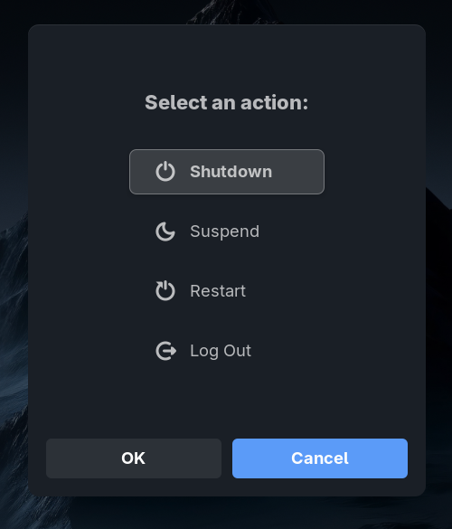

<p align="center">
  
</p>

<h1 align="center">Power Menu</h1>

<p align="center">
  A modern, interactive power dialogue for GNOME Shell.
  <br>
  Triggered with <b>Alt + F4</b> on the desktop to manage Shutdown, Restart, Suspend, and Log Out.
</p>

<p align="center">
  Built with ❤️ for the GNOME community.
</p>

---

### Features

- **Custom Keybinding:** Overrides the default Alt+F4 to show the dialogue when no windows are open.
- **Modern UI:** Clean, polished design that blends perfectly with GNOME Shell.
- **Customizable:** Reorder or hide actions through the settings menu.
- **Interactive:** Supports both keyboard navigation (arrows) and mouse interaction (hover & click).
- **Localized:** Full support for Arabic and English languages.
- **GNOME Ready:** Compatible with GNOME versions 45 up to 50.

---

### Screenshots

<p align="center">
  
</p>

---

### Installation

#### Manual Installation

1. Clone the repository:
    ```sh
    git clone https://github.com/e6ad2020/power-menu-gs-extension.git
    ```

2. Navigate to the directory:
    ```sh
    cd power-menu-gs-extension
    ```

3. Install the extension:
    ```sh
    ./install.sh
    ```

4. Restart GNOME Shell:
    - **Wayland:** Log out and log back in.
    - **X11:** Press `Alt+F2`, type `r`, and press `Enter`.

5. Enable the extension using the **Extensions** app.

---

### Usage

- Press **Alt+F4** when no windows are active to trigger the dialogue.
- Use **Arrow Keys** or **Mouse** to select an action.
- Press **Enter** or **Click** to confirm.

---

### License

This project is licensed under the MIT License. See the [LICENSE](LICENSE) file for details.